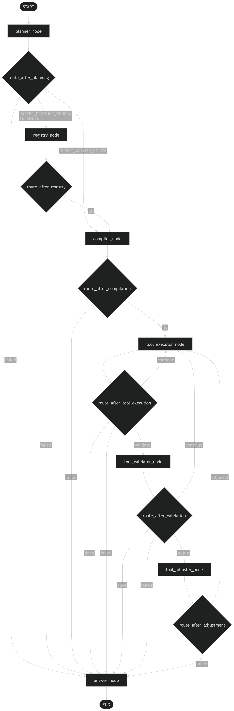

# Raster Map Agent

Raster Map Agent 是一个自然语言驱动的 **栅格地图生成Agent**。用户用自然语言描述想生成的遥感专题图，系统会规划任务、使用真实 Sentinel-2 数据运行受控 workflow，并输出 GeoTIFF、预览图和精简 metadata。

当前项目不是 production-ready GIS 平台，也不是通用遥感产品引擎；它是一个本地端到端可运行的 V1 agent，核心目标是验证自然语言规划、受控工具链执行和遥感产品生成流程。

## 当前 V1 状态

V1 已经完成本地端到端 raster map generation workflow：

- planner 解析用户请求并决定 route；
- 制图任务进入 `raster_product_generate`；
- 普通知识问题、系统能力问题或当前不支持的产品请求进入 `direct_answer`；
- raster route 使用真实 Sentinel-2 STAC 查询、影像下载、AOI 裁剪、指数计算、预览图渲染、metadata 导出和 final answer 生成；
- workflow 通过 compiler 生成受控 `tool_calls`，executor 单步执行；
- `raster_prepare` 具备 validator / adjuster retry loop；
- 失败时返回结构化错误信息或失败回答；
- 非制图任务不会强行运行 raster workflow。

## 支持产品

当前真实执行链路的遥感数据来源于 Sentinel-2。Registry 中保留了 Landsat 配置，但 V1 的 `raster_prepare` 只接入 Sentinel-2。

| 产品 | 含义 | 主要用途 | V1 支持 | 数据源 |
| --- | --- | --- | --- | --- |
| NDVI | Normalized Difference Vegetation Index | 植被绿度、植被覆盖、作物长势 | 是 | Sentinel-2 |
| SAVI | Soil Adjusted Vegetation Index | 稀疏植被、裸土背景较强区域的植被分析 | 是 | Sentinel-2 |
| NDWI | Normalized Difference Water Index | 水体、水域分布、地表水提取 | 是 | Sentinel-2 |
| NDMI | Normalized Difference Moisture Index | 植被含水量、地表湿度、干旱胁迫 | 是 | Sentinel-2 |
| NDBI | Normalized Difference Built-up Index | 建成区、不透水面、城市扩张 | 是 | Sentinel-2 |
| NBR | Normalized Burn Ratio | 火烧迹地、火灾影响、植被受损 | 是 | Sentinel-2 |

DEM、population、night lights、land cover、GEE、多数据源自动选择等不属于当前 V1 已实现功能。

## 高层架构

当前 workflow 是一个受控型 LangGraph tool-call workflow, 由一组明确的 node 组成：

- planner_node：根据用户输入生成受控 plan，并决定任务选择 `raster_product_generate` route 还是 `direct_answer` route；
- registry_node：仅在 `raster_product_generate` 任务中执行，用于解析指数、数据源、波段、公式和渲染配置；
- compiler_node：将 plan 和 registry 上下文编译成线性的 tool_calls；
- tool_executor_node：逐步执行 tool_call；
- tool_validator_node：当刚刚执行完成的 tool_call 存在 tool rule 时，对该 tool 的结果进行验证；
- tool_adjuster_node：当验证结果为 retryable 时，调整该 tool_call 的参数，并将 workflow 拉回 execute_tool 重新执行；
- answer_node：作为最终终止节点，返回 final answer，或在失败情况下生成 fallback response。

`raster_product_generate` route 的受控工具链：

```text
workspace.create_workspace
raster_prepare.prepare_raster_inputs
index_calculation.calculate_raster_index
render_preview.render_index_preview
metadata.export_metadata
answer.generate_final_answer
```

`direct_answer` route 只执行：

```text
answer.generate_final_answer
```

## LangGraph 完整工作流架构
<p align="center">
  
</p>


## 项目结构：

```text
app/
  agent/                 # planner、workflow nodes、validator、adjuster
  registry/              # Sentinel-2 指数产品配置
  schemas/               # AgentState
  tools/                 # 可独立测试的领域工具
  workflows/             # templates、compiler、executor、tool rules
docs/                    # 设计与开发文档
scripts/                 # 本地运行脚本
tests/                   # 单元测试
data/                    # 本地运行产物，不进入 git
```

## 本地运行

安装依赖：

```bash
pip install -r requirements.txt
pip install -r requirements-dev.txt
```

配置 `.env`：

本项目 LLM 提供方选择智谱: https://open.bigmodel.cn/
```env
ZHIPUAI_API_KEY=
ZHIPUAI_MODEL=glm-4.7-flash
ZHIPUAI_BASE_URL=https://open.bigmodel.cn/api/paas/v4
DATA_DIR=./data
```

运行示例：

```bash
python scripts/run_workflow.py
```

运行完成后查看：

```text
data/<uuid>/output/
  metadata.json
  preview.png
  result.tif
```

## 输出结果

无论用户请求 NDVI、SAVI、NDWI、NDMI、NDBI 还是 NBR，用户侧输出统一命名为：

- `metadata.json`：面向用户和结果溯源的精简产品信息；
- `preview.png`：渲染后的 PNG 预览图；
- `result.tif`：最终指数 GeoTIFF。

产品类型、指数名、公式、数据源、时间范围、空间信息、质量诊断等写入 `metadata.json`，不再通过文件名表达产品类型。

## Direct Answer

`direct_answer` route 用于：

- 普通知识问题；
- 系统能力问题，例如“你能做什么？”；
- 当前不支持的产品请求。

该 route 不会运行 raster tools，也不会创建完整 raster workflow。能力问答会明确当前 V1 支持 NDVI、SAVI、NDWI、NDMI、NDBI、NBR；不支持的产品会被诚实说明，并建议用户询问系统功能或改用已支持的指数产品。

## V1 限制

这些限制是 V1 边界，不是缺陷：

- 当前真实 raster preparation 只接入 Sentinel-2；
- Sentinel-2 单 tile 约为 100 km * 100 km，V1 最大可下载 scene 数量限制为 20，本地内存不足时可能达不到这个数；
- 当前适合中小尺度行政区或城市区域，推荐覆盖面积小于 10 万平方千米；
- 过大的 AOI 可能导致下载慢、处理慢或失败；
- 靠海城市、包含领海、岛屿或复杂 MultiPolygon 的 AOI 可能出现覆盖率与视觉效果不稳定；
- 当前日志主要输出在终端，尚未持久化为 `workflow_trace.json`；
- 当前是本地命令行 / local workflow，没有 Web 前端；
- 当前没有 FastAPI backend、Redis queue、worker、job lifecycle manager、用户系统；
- 当前没有 GEE、多数据源自动选择、DEM、population、night lights、land cover 产品；
- 当前不是生产级 GIS 平台，而是本地可运行的 V1 agent。

## V2 方向

V2 将聚焦服务化和部署：

- FastAPI backend；
- Redis queue；
- worker；
- frontend；
- job status API；
- file download API；
- job lifecycle cleanup；
- CPU server deployment。

V3 / future research 可以探索 GEE-based raster_prepare 替代工具包，用于全球范围 scale-aware source 自动选择，以及 DEM、population、night lights、land cover 等更多专题产品。

## 文档

详细设计见 `docs/`：

- [导航](docs/index.md)
- [V1 总结](docs/v1-summary.md)
- [项目架构](docs/architecture.md)
- [开发日志](docs/development-log.md)
- [栅格工具链](docs/raster-toolchain.md)
- [关键设计决策](docs/design-decisions.md)
- [Demo Cases](docs/demo-cases.md)
- [Scene 选择算法迭代](docs/scene-selection-evolution.md)
- [路线图](docs/roadmap.md)

或者访问：https://raster-map-agent.readthedocs.io/en/latest/
