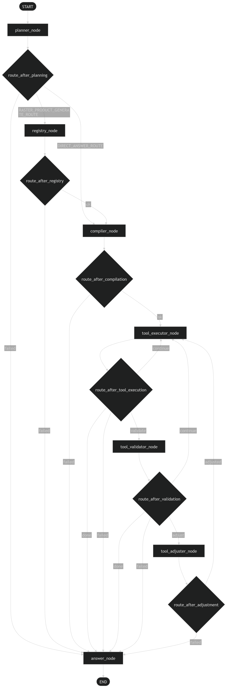

# Raster Map Agent

[中文](#raster-map-agent) | [English](#english)

Raster Map Agent 是一个自然语言驱动的 **栅格地图生成Agent**。用户用自然语言描述想生成的遥感专题图，系统会规划任务、使用真实 Sentinel-2 数据运行受控 workflow，并输出 GeoTIFF、预览图和精简 metadata。

快速访问：https://raster-map-agent.vercel.app/ （需要访问外网）

项目详细文档：https://raster-map-agent.readthedocs.io/en/latest/

> 注意：没有租长期服务器（抱歉🙃），服务不一定在线，如果无法访问或需要体验，欢迎联系Email-`a1913397362@163.com`


## 当前状态

已经
- V1 完成本地端到端 raster map generation workflow：

- V2 完成了从本地 workflow 到可访问服务的闭环：FastAPI + Redis + worker 后端、Vue 前端、结果下载接口，以及通过 Vercel + 内网穿透进行外部访问。


## 支持产品

当前真实执行链路的遥感数据来源于 Sentinel-2。Registry 中保留了 Landsat 配置，但 V1 的 `raster_prepare` 只接入 Sentinel-2。

| 产品 | 含义 | 主要用途 | V1 支持 | 数据源 |
| --- | --- | --- | --- | --- |
| NDVI | Normalized Difference Vegetation Index | 植被绿度、植被覆盖、作物长势 | 是 | Sentinel-2 |
| SAVI | Soil Adjusted Vegetation Index | 稀疏植被、裸土背景较强区域的植被分析 | 是 | Sentinel-2 |
| NDWI | Normalized Difference Water Index | 水体、水域分布、地表水提取 | 是 | Sentinel-2 |
| NDMI | Normalized Difference Moisture Index | 植被含水量、地表湿度、干旱胁迫 | 是 | Sentinel-2 |
| NDBI | Normalized Difference Built-up Index | 建成区、不透水面、城市扩张 | 是 | Sentinel-2 |
| NBR | Normalized Burn Ratio | 火烧迹地、火灾影响、植被受损 | 是 | Sentinel-2 |

DEM、population、night lights、land cover、GEE、多数据源自动选择等不属于当前 V1 已实现功能。

## 高层架构

当前 workflow 是一个受控型 LangGraph tool-call workflow, 由一组明确的 node 组成：

- planner_node：根据用户输入生成受控 plan，并决定任务选择 `raster_product_generate` route 还是 `direct_answer` route；
- registry_node：仅在 `raster_product_generate` 任务中执行，用于解析指数、数据源、波段、公式和渲染配置；
- compiler_node：将 plan 和 registry 上下文编译成线性的 tool_calls；
- tool_executor_node：逐步执行 tool_call；
- tool_validator_node：当刚刚执行完成的 tool_call 存在 tool rule 时，对该 tool 的结果进行验证；
- tool_adjuster_node：当验证结果为 retryable 时，调整该 tool_call 的参数，并将 workflow 拉回 execute_tool 重新执行；
- answer_node：作为最终终止节点，返回 final answer，或在失败情况下生成 fallback response。

`raster_product_generate` route 的受控工具链：

```text
workspace.create_workspace
raster_prepare.prepare_raster_inputs
index_calculation.calculate_raster_index
render_preview.render_index_preview
metadata.export_metadata
answer.generate_final_answer
```

`direct_answer` route 只执行：

```text
answer.generate_final_answer
```

## LangGraph 完整工作流架构
<p align="center">
  
</p>


## 项目结构：

```text
app/
  agent/                 # planner、workflow nodes、validator、adjuster
  registry/              # Sentinel-2 指数产品配置
  schemas/               # AgentState
  tools/                 # 可独立测试的领域工具
  workflows/             # templates、compiler、executor、tool rules
docs/                    # 设计与开发文档
scripts/                 # 本地运行脚本
tests/                   # 单元测试
data/                    # 本地运行产物，不进入 git
```

## 本地运行

安装依赖：

```bash
pip install -r requirements.txt
pip install -r requirements-dev.txt
```

配置 `.env`：

本项目 LLM 提供方选择智谱: https://open.bigmodel.cn/
```env
ZHIPUAI_API_KEY=
ZHIPUAI_MODEL=glm-4.7-flash
ZHIPUAI_BASE_URL=https://open.bigmodel.cn/api/paas/v4
DATA_DIR=./data
```

运行示例：

```bash
python scripts/run_workflow.py
```

运行完成后查看：

```text
data/<uuid>/output/
  metadata.json
  preview.png
  result.tif
```

## 本地 Backend / Frontend 运行

当前项目已经包含一个最小可用的 FastAPI backend、Redis 队列、 worker 和 frontend。后端会把一次用户请求包装成一个 job，并通过 job id 查询状态、下载结果文件。默认本地前端：`http://127.0.0.1:8000`。

> 注意：运行前请先准备好 Docker Desktop、Node.js / npm，并确保 `.env` 已正确配置。

使用 Docker Compose 启动后端：

```bash
docker compose up --build
```

启动前端：
```bash
cd frontend
npm ci
npm run dev
```

启动后包含：

- `默认监听`: http://127.0.0.1:8000；
- `api`：FastAPI 服务；
- `redis`：保存 job 状态并作为任务队列；
- `worker`：默认 2 个 worker，从 Redis 队列消费 job 并执行 workflow；


可访问接口文档：

```text
http://127.0.0.1:8000/docs
```

主要接口：

```text
POST /jobs
GET /jobs/{job_id}
GET /jobs/{job_id}/metadata
GET /jobs/{job_id}/preview
GET /jobs/{job_id}/result
GET /health
```

一次用户请求会创建一个 job。Raster job 成功后，后端通过 `job_id` 返回对应 workspace 中的 `metadata.json`、`preview.png` 和 `result.tif`。当前 job 默认保留 30 分钟，之后 worker 会删除 Redis job 记录和对应 workspace。

## 输出结果

无论用户请求 NDVI、SAVI、NDWI、NDMI、NDBI 还是 NBR，用户侧输出统一命名为：

- `metadata.json`：面向用户和结果溯源的精简产品信息；
- `preview.png`：渲染后的 PNG 预览图；
- `result.tif`：最终指数 GeoTIFF。

产品类型、指数名、公式、数据源、时间范围、空间信息、质量诊断等写入 `metadata.json`，不再通过文件名表达产品类型。

## Direct Answer

`direct_answer` route 用于：

- 普通知识问题；
- 系统能力问题，例如“你能做什么？”；
- 当前不支持的产品请求。

该 route 不会运行 raster tools，也不会创建完整 raster workflow。能力问答会明确当前 V1 支持 NDVI、SAVI、NDWI、NDMI、NDBI、NBR；不支持的产品会被诚实说明，并建议用户询问系统功能或改用已支持的指数产品。

## V1 限制

以下是 V1 边界或者需要注意的地方：

- 当前真实 raster preparation 只接入 Sentinel-2；
- Sentinel-2 单 tile 约为 100 km * 100 km，考虑运行等待时间与运行内存限制，V1 最大可下载 scene 数量限制为 20，本地内存不足时可能达不到这个数；
- 当前适合中小尺度行政区或城市区域，推荐覆盖面积小于 10 万平方千米；
- 过大的 AOI 可能导致下载慢、处理慢或失败；
- 靠海城市、包含领海、岛屿或复杂 MultiPolygon 的 AOI 可能出现覆盖率与视觉效果不稳定；
- 当前日志主要输出在终端，尚未持久化为 `workflow_trace.json`；
- V1 workflow 本身是本地命令行 / local workflow，没有 Web 前端；
- V1 本身没有 FastAPI backend、Redis queue、worker、job lifecycle manager、用户系统；
- 当前没有 GEE、多数据源自动选择、DEM、population、night lights、land cover 产品；
- 当前不是生产级 GIS 平台，而是本地可运行的 V1 agent。

## V2 当前状态

V2 已经完成本地服务化和展示部署闭环。V2 不改变 V1 的 raster workflow、工具链、指数算法和受控执行架构，而是在 V1 外层增加：

- FastAPI backend；
- Redis queue；
- 默认 2 个 worker；
- job 创建、状态查询、状态消息和结果下载 API；
- worker 心跳与 running job 心跳失联兜底；
- 30 分钟 job / workspace lifecycle cleanup；
- Vue / Vite / TypeScript 前端；
- `preview.png` 展示与 `metadata.json`、`preview.png`、`result.tif` 下载；
- Vercel 前端部署；
- 本地电脑 Docker 后端通过内网穿透提供公网访问。

当前 V2 部署形态是：

```text
Vercel 前端
  -> 内网穿透公网地址
    -> 本地 Docker backend
      -> FastAPI API / Redis / workers
```

该部署适合演示和小规模试用，不是生产级 GIS 平台。长期稳定运行仍需要固定域名、稳定后端服务器、监控、日志、鉴权和更完整的任务管理。

V3 / future research 可以探索 GEE-based raster_prepare 替代工具包，用于全球范围 scale-aware source 自动选择，以及 DEM、population、night lights、land cover 等更多专题产品。

## 文档

详细设计见 `docs/`：

- [导航](docs/index.md)
- [V1 总结](docs/v1-summary.md)
- [项目架构](docs/architecture.md)
- [开发日志](docs/development-log.md)
- [Backend 服务](docs/backend.md)
- [Frontend 前端](docs/frontend.md)
- [V2 部署](docs/deployment.md)
- [栅格工具链](docs/raster-toolchain.md)
- [关键设计决策](docs/design-decisions.md)
- [Demo Cases](docs/demo-cases.md)
- [Scene 选择算法迭代](docs/scene-selection-evolution.md)
- [路线图](docs/roadmap.md)

或者访问：https://raster-map-agent.readthedocs.io/en/latest/

## English

Raster Map Agent is a natural-language-driven **raster map generation agent**. Users describe the remote-sensing thematic map they want in natural language. The system plans the task, runs a controlled workflow with real Sentinel-2 data, and outputs a GeoTIFF, a preview image, and concise metadata.

Quick access: https://raster-map-agent.vercel.app/

Full English documentation: https://raster-map-agent.readthedocs.io/en/latest/en/

> Note: this project does not currently run on a rented long-term server, so the public service may not always be online. If the site is unavailable or you would like a demo, please contact `a1913397362@163.com`.

### Current Status

Completed:

- V1: a local end-to-end raster map generation workflow.
- V2: a full path from the local workflow to an accessible service, including a FastAPI + Redis + worker backend, a Vue frontend, result download APIs, and public access through Vercel plus an intranet tunnel.

### Supported Products

The currently executable remote-sensing data pipeline uses Sentinel-2. Landsat configuration is retained in the registry, but V1 `raster_prepare` is connected only to Sentinel-2.

| Product | Meaning | Main Uses | V1 Support | Data Source |
| --- | --- | --- | --- | --- |
| NDVI | Normalized Difference Vegetation Index | Vegetation greenness, vegetation cover, crop growth | Yes | Sentinel-2 |
| SAVI | Soil Adjusted Vegetation Index | Vegetation analysis in sparse vegetation or strong bare-soil background areas | Yes | Sentinel-2 |
| NDWI | Normalized Difference Water Index | Water bodies, water distribution, surface-water extraction | Yes | Sentinel-2 |
| NDMI | Normalized Difference Moisture Index | Vegetation water content, surface moisture, drought stress | Yes | Sentinel-2 |
| NDBI | Normalized Difference Built-up Index | Built-up areas, impervious surfaces, urban expansion | Yes | Sentinel-2 |
| NBR | Normalized Burn Ratio | Burn scars, fire impact, vegetation damage | Yes | Sentinel-2 |

DEM, population, night lights, land cover, GEE, and automatic multi-source selection are not implemented in the current V1 feature set.

### High-Level Architecture

The current workflow is a controlled LangGraph tool-call workflow composed of explicit nodes:

- `planner_node`: creates a controlled plan from the user input and routes the task to either `raster_product_generate` or `direct_answer`.
- `registry_node`: runs only for `raster_product_generate` tasks and resolves the index, data source, bands, formula, and rendering configuration.
- `compiler_node`: compiles the plan and registry context into linear tool calls.
- `tool_executor_node`: executes tool calls step by step.
- `tool_validator_node`: validates a tool result when the completed tool call has a tool rule.
- `tool_adjuster_node`: adjusts a tool call when validation returns a retryable result, then sends the workflow back to execute the tool again.
- `answer_node`: the terminal node that returns the final answer or generates a fallback response on failure.

Controlled tool chain for the `raster_product_generate` route:

```text
workspace.create_workspace
raster_prepare.prepare_raster_inputs
index_calculation.calculate_raster_index
render_preview.render_index_preview
metadata.export_metadata
answer.generate_final_answer
```

The `direct_answer` route executes only:

```text
answer.generate_final_answer
```

### Full LangGraph Workflow

<p align="center">
  
</p>

### Project Structure

```text
app/
  agent/                 # planner, workflow nodes, validator, adjuster
  registry/              # Sentinel-2 index product configuration
  schemas/               # AgentState
  tools/                 # domain tools that can be tested independently
  workflows/             # templates, compiler, executor, tool rules
docs/                    # design and development documentation
scripts/                 # local run scripts
tests/                   # unit tests
data/                    # local runtime artifacts, excluded from git
```

### Local Run

Install dependencies:

```bash
pip install -r requirements.txt
pip install -r requirements-dev.txt
```

Configure `.env`:

This project uses Zhipu AI as the LLM provider: https://open.bigmodel.cn/

```env
ZHIPUAI_API_KEY=
ZHIPUAI_MODEL=glm-4.7-flash
ZHIPUAI_BASE_URL=https://open.bigmodel.cn/api/paas/v4
DATA_DIR=./data
```

Run the example:

```bash
python scripts/run_workflow.py
```

After the run completes, check:

```text
data/<uuid>/output/
  metadata.json
  preview.png
  result.tif
```

### Local Backend / Frontend Run

The project includes a minimal usable FastAPI backend, Redis queue, workers, and frontend. The backend wraps each user request as a job, then uses the job id to query status and download result files. The default local frontend is `http://127.0.0.1:8000`.

> Note: before running, make sure Docker Desktop, Node.js / npm, and a correctly configured `.env` file are available.

Start the backend with Docker Compose:

```bash
docker compose up --build
```

Start the frontend:

```bash
cd frontend
npm run dev
```

The running stack includes:

- `Default listener`: http://127.0.0.1:8000
- `api`: FastAPI service
- `redis`: stores job status and acts as the task queue
- `worker`: 2 workers by default, consuming jobs from Redis and executing the workflow

API documentation:

```text
http://127.0.0.1:8000/docs
```

Main endpoints:

```text
POST /jobs
GET /jobs/{job_id}
GET /jobs/{job_id}/metadata
GET /jobs/{job_id}/preview
GET /jobs/{job_id}/result
GET /health
```

Each user request creates a job. After a raster job succeeds, the backend returns the corresponding `metadata.json`, `preview.png`, and `result.tif` from the workspace through `job_id`. Jobs are currently retained for 30 minutes by default, after which the worker deletes the Redis job record and the corresponding workspace.

### Outputs

Whether the user requests NDVI, SAVI, NDWI, NDMI, NDBI, or NBR, output files are named consistently:

- `metadata.json`: concise product information for users and result provenance
- `preview.png`: rendered PNG preview
- `result.tif`: final index GeoTIFF

Product type, index name, formula, data source, time range, spatial information, and quality diagnostics are written to `metadata.json` instead of being encoded in file names.

### Direct Answer

The `direct_answer` route is used for:

- general knowledge questions
- system capability questions, such as "What can you do?"
- requests for currently unsupported products

This route does not run raster tools or create the full raster workflow. Capability answers clearly state that V1 currently supports NDVI, SAVI, NDWI, NDMI, NDBI, and NBR. Unsupported products are explained honestly, with suggestions to ask about system capabilities or use a supported index product.

### V1 Limitations

The following are V1 boundaries or caveats:

- Real raster preparation currently uses only Sentinel-2.
- A Sentinel-2 tile is about 100 km * 100 km. Considering runtime and memory limits, V1 can download at most 20 scenes; this limit may be lower when local memory is insufficient.
- The current version is suitable for small to medium administrative regions or urban areas. A coverage area below 100,000 square kilometers is recommended.
- Very large AOIs may cause slow downloads, slow processing, or failures.
- AOIs for coastal cities, territorial seas, islands, or complex MultiPolygons may produce unstable coverage rates or visual results.
- Logs are currently printed mainly to the terminal and are not yet persisted as `workflow_trace.json`.
- V1 itself is a local command-line workflow and does not include a web frontend.
- V1 itself does not include a FastAPI backend, Redis queue, workers, a job lifecycle manager, or a user system.
- GEE, automatic multi-source selection, DEM, population, night lights, and land cover products are not currently available.
- This is not a production-grade GIS platform; it is a locally runnable V1 agent.

### V2 Current Status

V2 has completed the local service layer and demo deployment loop. It does not change the V1 raster workflow, tool chain, index algorithms, or controlled execution architecture. Instead, it adds:

- FastAPI backend
- Redis queue
- 2 workers by default
- APIs for job creation, status query, status messages, and result downloads
- worker heartbeat and fallback handling for lost running-job heartbeats
- 30-minute job / workspace lifecycle cleanup
- Vue / Vite / TypeScript frontend
- `preview.png` display and downloads for `metadata.json`, `preview.png`, and `result.tif`
- Vercel frontend deployment
- public access to the local Docker backend through an intranet tunnel

Current V2 deployment shape:

```text
Vercel frontend
  -> intranet tunnel public URL
    -> local Docker backend
      -> FastAPI API / Redis / workers
```

This deployment is suitable for demos and small-scale trials, not for a production-grade GIS platform. Long-term stable operation still requires a fixed domain, stable backend server, monitoring, logs, authentication, and more complete task management.

V3 / future research may explore a GEE-based replacement for `raster_prepare`, enabling global scale-aware source selection and additional thematic products such as DEM, population, night lights, and land cover.

### Documentation

Detailed design documents are available in `docs/en/`:

- [Navigation](docs/en/index.md)
- [V1 Summary](docs/en/v1-summary.md)
- [Project Architecture](docs/en/architecture.md)
- [Development Log](docs/en/development-log.md)
- [Backend Service](docs/en/backend.md)
- [Frontend](docs/en/frontend.md)
- [V2 Deployment](docs/en/deployment.md)
- [Raster Toolchain](docs/en/raster-toolchain.md)
- [Key Design Decisions](docs/en/design-decisions.md)
- [Demo Cases](docs/en/demo-cases.md)
- [Scene Selection Evolution](docs/en/scene-selection-evolution.md)
- [Roadmap](docs/en/roadmap.md)

Or visit: https://raster-map-agent.readthedocs.io/en/latest/en/
