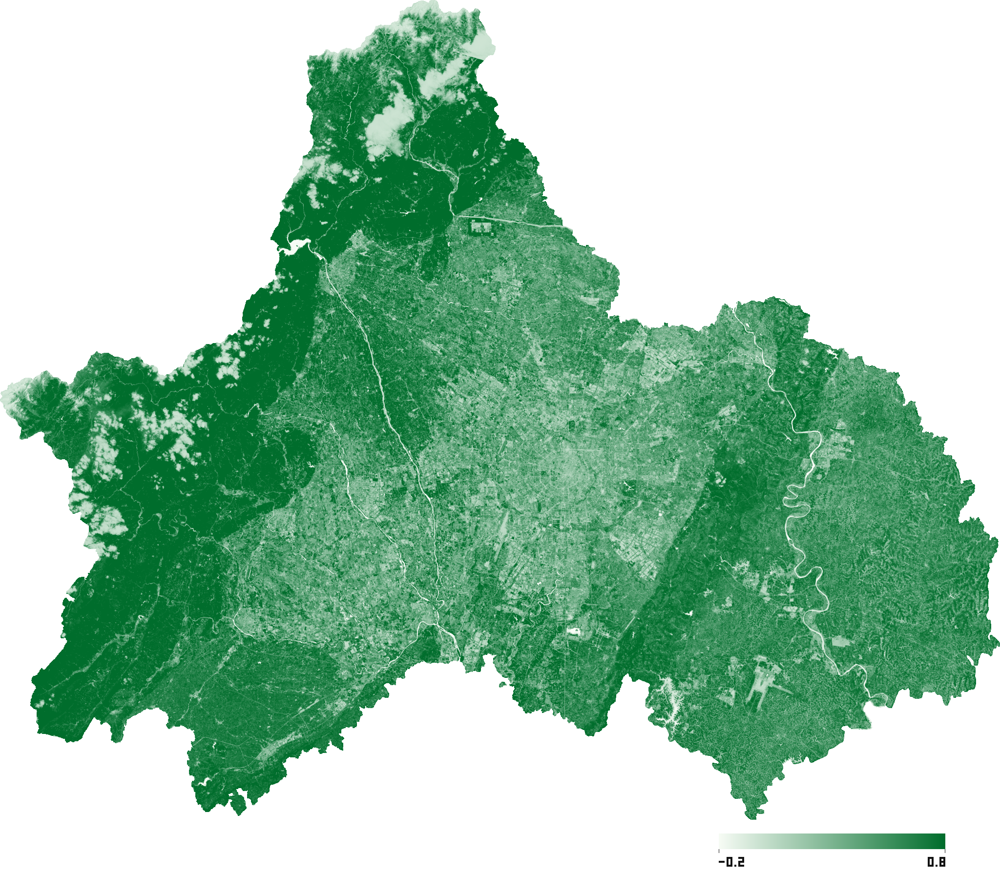
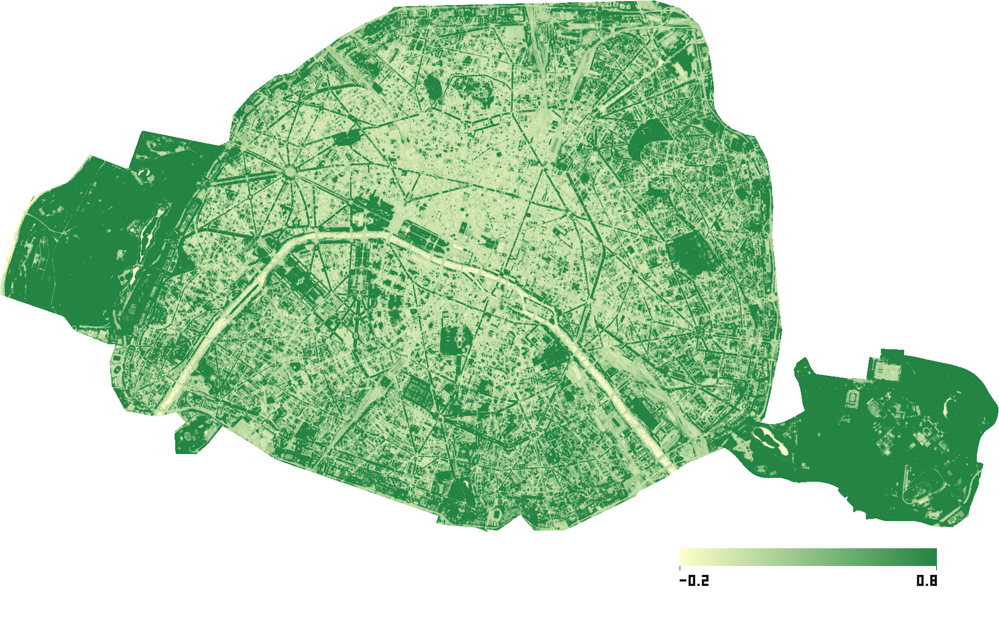
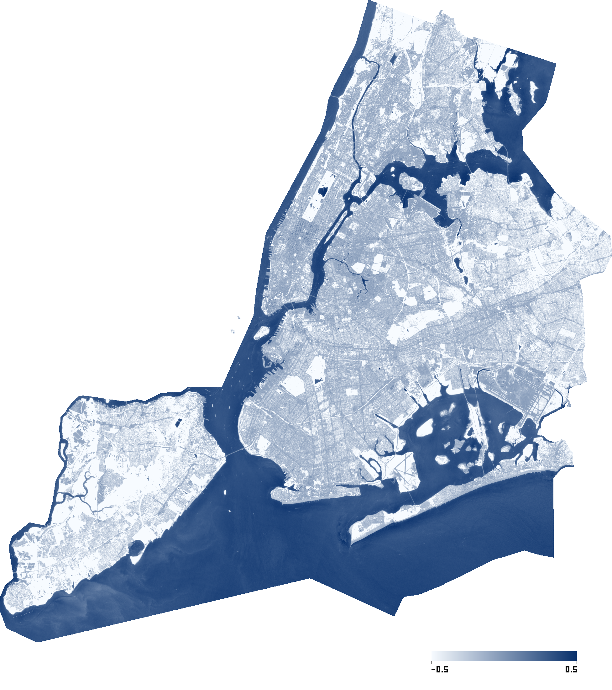
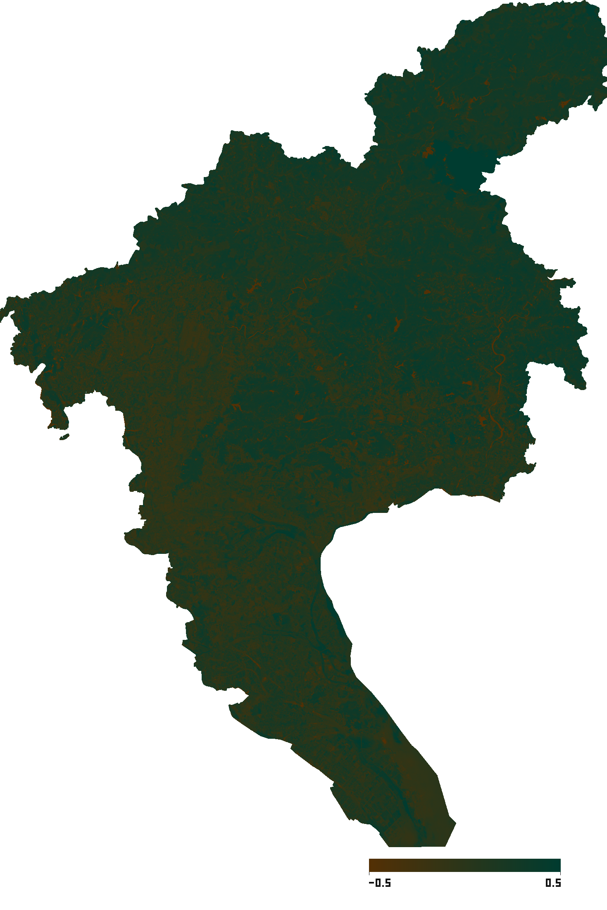
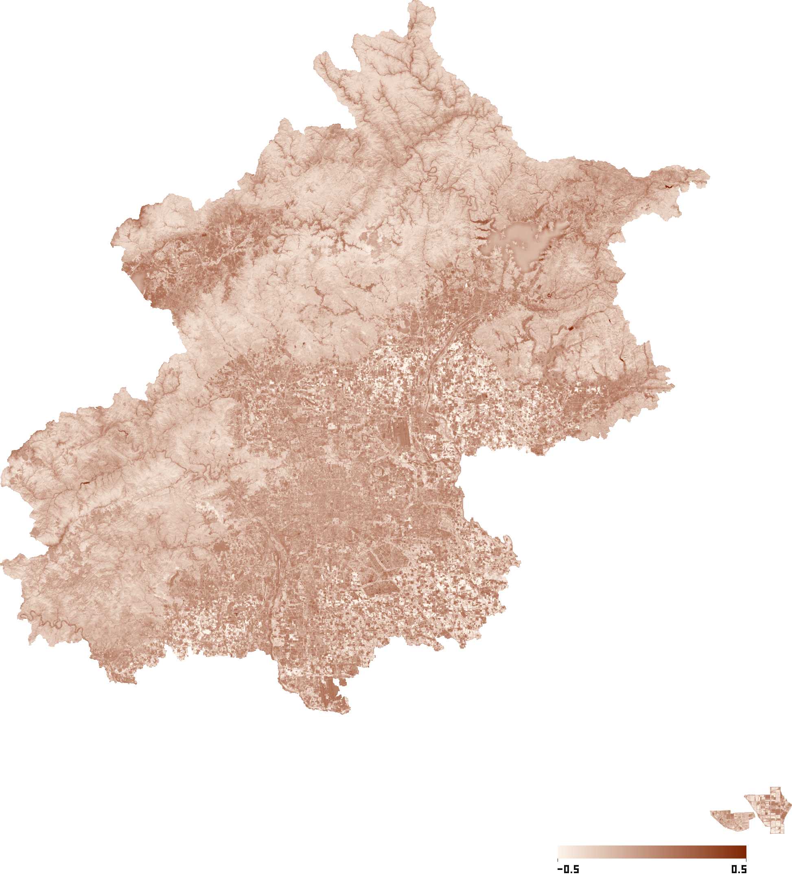
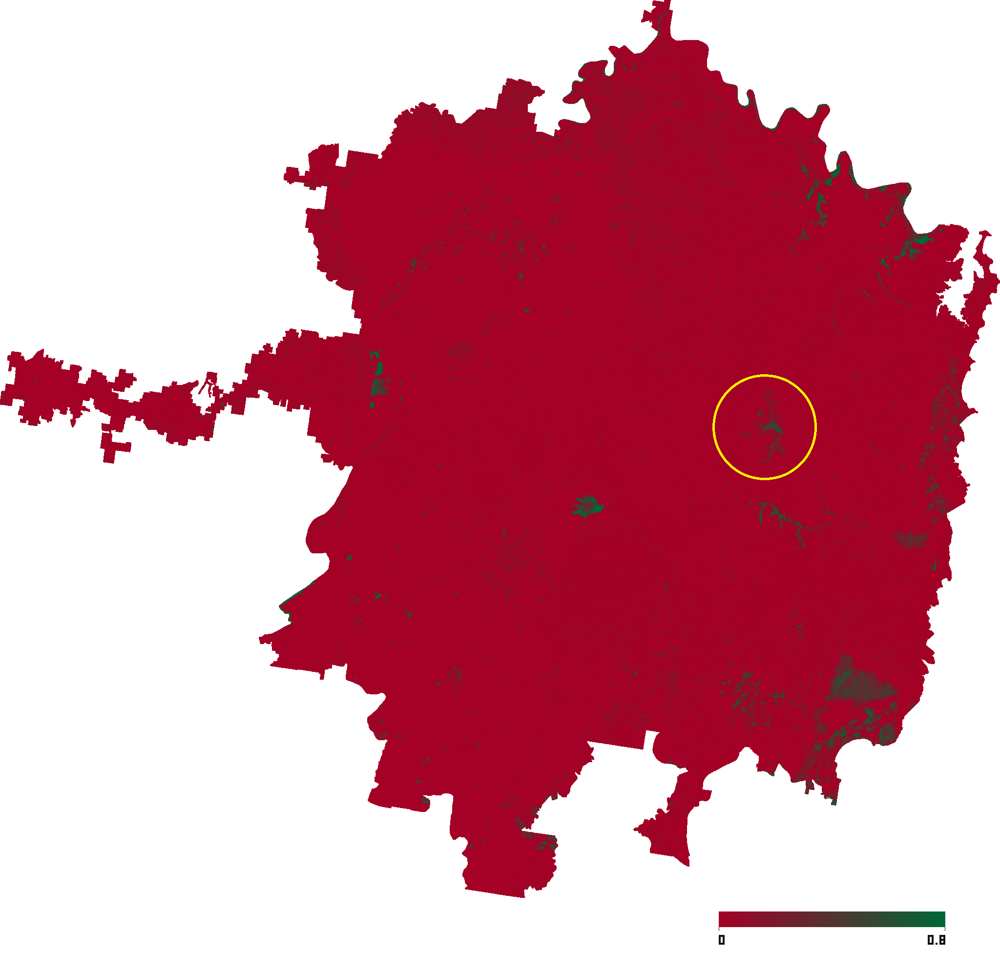
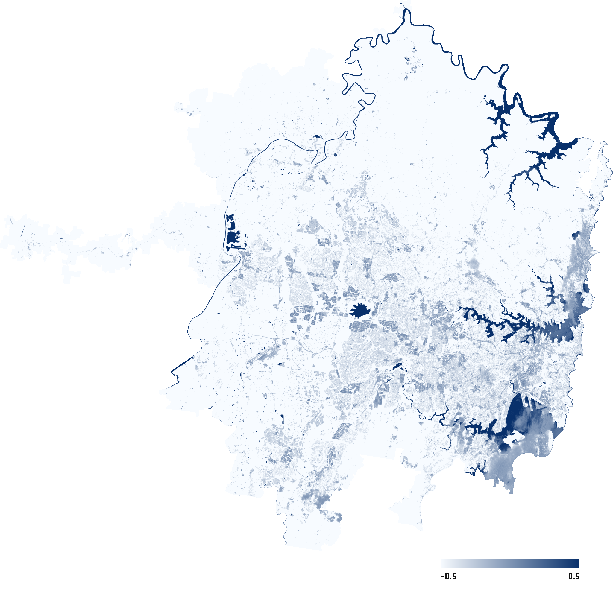

# Demo Cases

本文展示当前 V1 的 Sentinel-2 指数 demo case。材料来自 `docs/materials/` 中已经生成的 `preview.png` 与 `metadata.json` 等价文件。

所有 case 的用户侧输出结构统一为：

```text
data/<uuid>/output/
  metadata.json
  preview.png
  result.tif
```

本文只展示预览图和 metadata 摘要，不展示 `result.tif`。预览图用于说明 V1 workflow 已经完成端到端输出，不在本文中做严格遥感定量解译。

## 成都 - Chengdu - NDVI



| 字段 | 内容 |
| --- | --- |
| 产品 | NDVI |
| 用途 | 植被绿度、植被覆盖、作物长势 |
| AOI | Chengdu, Sichuan, China |
| 数据源 | Sentinel-2 via earth_search |
| 时间范围 | 2026-04-01 至 2026-05-29 |
| 最大云量 | 20% |
| 覆盖状态 | covered |
| 覆盖率 | 1.0000 |
| 选中 scenes | 5 |
| CRS | EPSG:32648 |
| 分辨率 | 10 m |
| 栅格尺寸 | 18231 x 14955 |
| Metadata | [ndvi.json](materials/ndvi.json) |

## 巴黎 - Paris - SAVI



| 字段 | 内容 |
| --- | --- |
| 产品 | SAVI |
| 用途 | 稀疏植被、裸土背景较强区域的植被分析 |
| AOI | Paris, France |
| 数据源 | Sentinel-2 via earth_search |
| 时间范围 | 2026-05-01 至 2026-05-30 |
| 最大云量 | 20% |
| 覆盖状态 | covered |
| 覆盖率 | 1.0000 |
| 选中 scenes | 1 |
| CRS | EPSG:32631 |
| 分辨率 | 10 m |
| 栅格尺寸 | 1802 x 961 |
| Metadata | [savi.json](materials/savi.json) |

## 纽约 - New York - NDWI



| 字段 | 内容 |
| --- | --- |
| 产品 | NDWI |
| 用途 | 水体、水域分布、地表水提取 |
| AOI | New York, USA |
| 数据源 | Sentinel-2 via earth_search |
| 时间范围 | 2025-06-01 至 2025-08-31 |
| 最大云量 | 20% |
| 覆盖状态 | covered |
| 覆盖率 | 1.0000 |
| 选中 scenes | 2 |
| CRS | EPSG:32618 |
| 分辨率 | 10 m |
| 栅格尺寸 | 4695 x 4924 |
| Metadata | [ndwi.json](materials/ndwi.json) |

## 广州 - Guangzhou - NDMI



| 字段 | 内容 |
| --- | --- |
| 产品 | NDMI |
| 用途 | 植被含水量、地表湿度、干旱胁迫 |
| AOI | Guangzhou, Guangdong, China |
| 数据源 | Sentinel-2 via earth_search |
| 时间范围 | 2023-11-01 至 2024-08-31 |
| 最大云量 | 20% |
| 覆盖状态 | covered |
| 覆盖率 | 0.9994 |
| 选中 scenes | 2 |
| CRS | EPSG:32649 |
| 分辨率 | 10 m |
| 栅格尺寸 | 10980 x 15309 |
| Metadata | [ndmi.json](materials/ndmi.json) |

## 北京 - Beijing - NDBI



| 字段 | 内容 |
| --- | --- |
| 产品 | NDBI |
| 用途 | 建成区、不透水面、城市扩张 |
| AOI | Beijing, China |
| 数据源 | Sentinel-2 via earth_search |
| 时间范围 | 2026-01-01 至 2026-05-29 |
| 最大云量 | 20% |
| 覆盖状态 | covered |
| 覆盖率 | 1.0000 |
| 选中 scenes | 8 |
| CRS | EPSG:32650 |
| 分辨率 | 20 m |
| 栅格尺寸 | 9953 x 10475 |
| Metadata | [ndbi.json](materials/ndbi.json) |

## 悉尼 - Sydney - NBR

NBR 比较特殊，火灾检测需要火灾前后对比，单张 tif 图并不能用于火烧迹地、火灾影响和植被受损分析。这里以发生在 2023 年末到 2024 年初澳大利亚东南部的火灾为例，选择悉尼行政区为 AOI 在两个时间窗口生成的 NBR 预览图。

<table>
  <tr>
    <th>NBR - 2023-09</th>
    <th>NBR - 2024-02</th>
  </tr>
  <tr>
    <td></td>
    <td></td>
  </tr>
</table>

| 字段 | 2023-09 | 2024-02 |
| --- | --- | --- |
| 产品 | NBR | NBR |
| 用途 | 火烧迹地、火灾影响、植被受损 | 火烧迹地、火灾影响、植被受损 |
| AOI | Sydney, New South Wales, Australia | Sydney, New South Wales, Australia |
| 数据源 | Sentinel-2 via earth_search | Sentinel-2 via earth_search |
| 时间范围 | 2023-09-01 至 2023-09-30 | 2024-02-01 至 2024-02-29 |
| 最大云量 | 20% | 20% |
| 覆盖状态 | covered | covered |
| 覆盖率 | 1.0000 | 1.0000 |
| 选中 scenes | 3 | 3 |
| CRS | EPSG:32756 | EPSG:32756 |
| 分辨率 | 10 m | 10 m |
| 栅格尺寸 | 10023 x 9006 | 10023 x 9006 |
| Metadata | [NBR202309.json](materials/NBR202309.json) | [NBR202402.json](materials/NBR202402.json) |

再计算 火灾前 tif - 火灾后 tif 的差异 dNBR tif, 数值越大说明损毁越严重。与此同时，由于 NBR = (NIR - SWIR) / (NIR + SWIR)，而水体在NIR 与 SWIR 波段的反射值都很小，所以（NIR + SWIR）的值很小，导致水体的NBR对微小噪声会非常敏感, 因此要查看真实火灾影响图还需要辅以卫星图或 NDWI 图排除干扰水体。

<table>
  <tr>
    <th>dNBR - 2023.09-2024.02</th>
    <th>NDWI</th>
  </tr>
  <tr>
    <td></td>
    <td></td>
  </tr>
</table>

