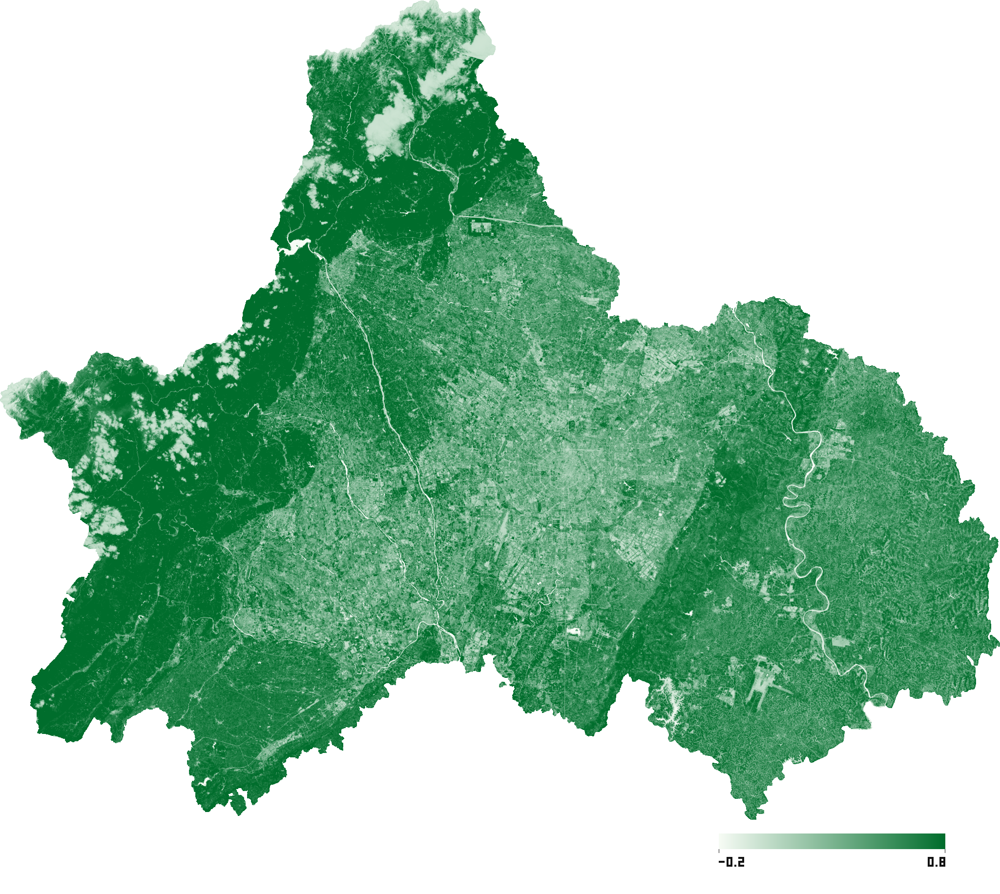
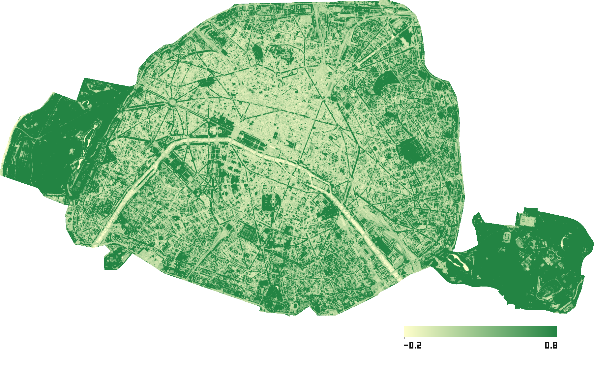
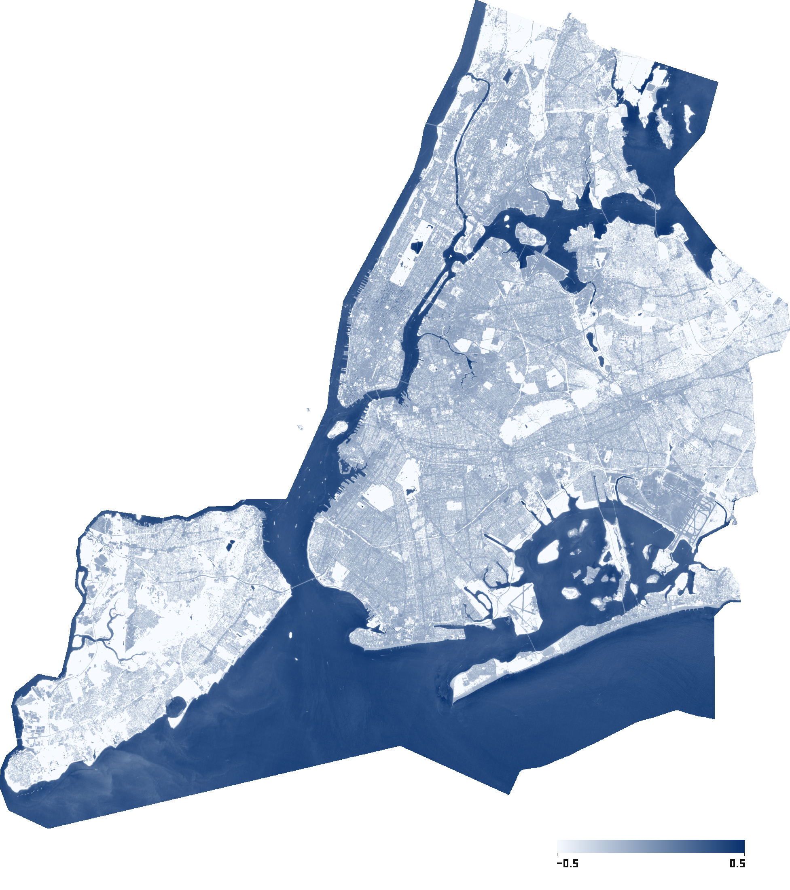
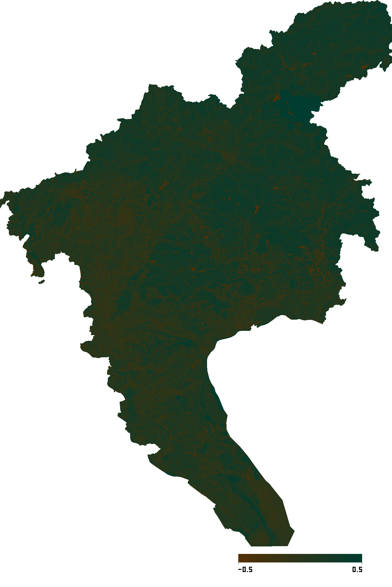
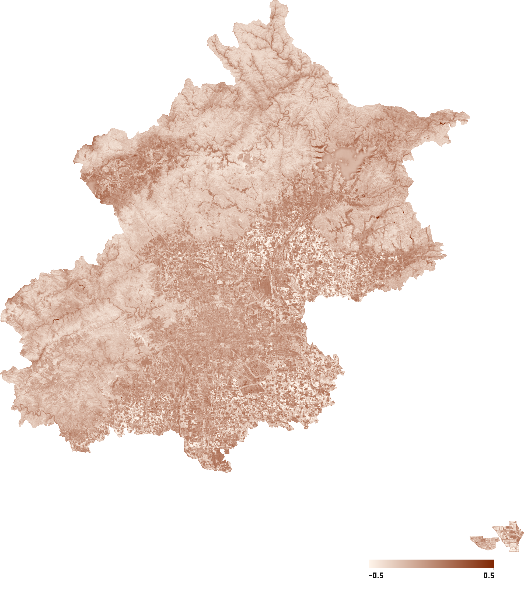
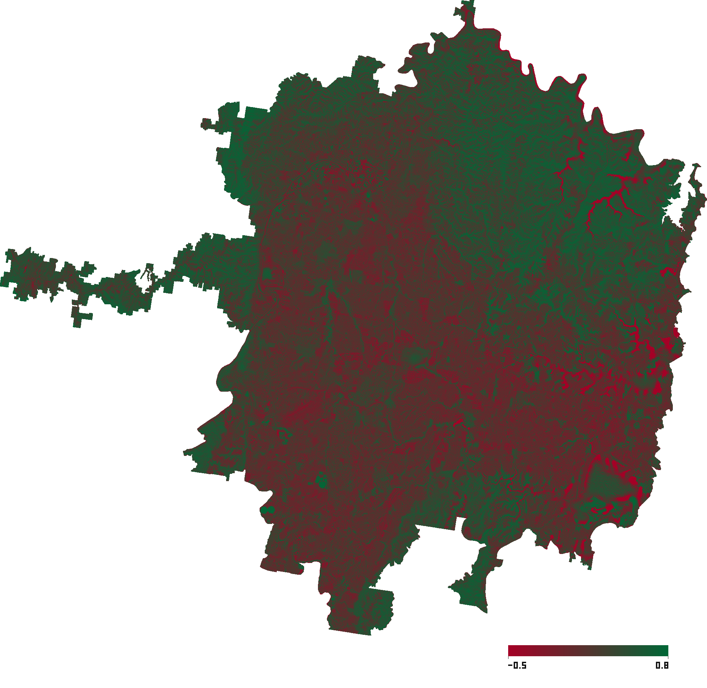
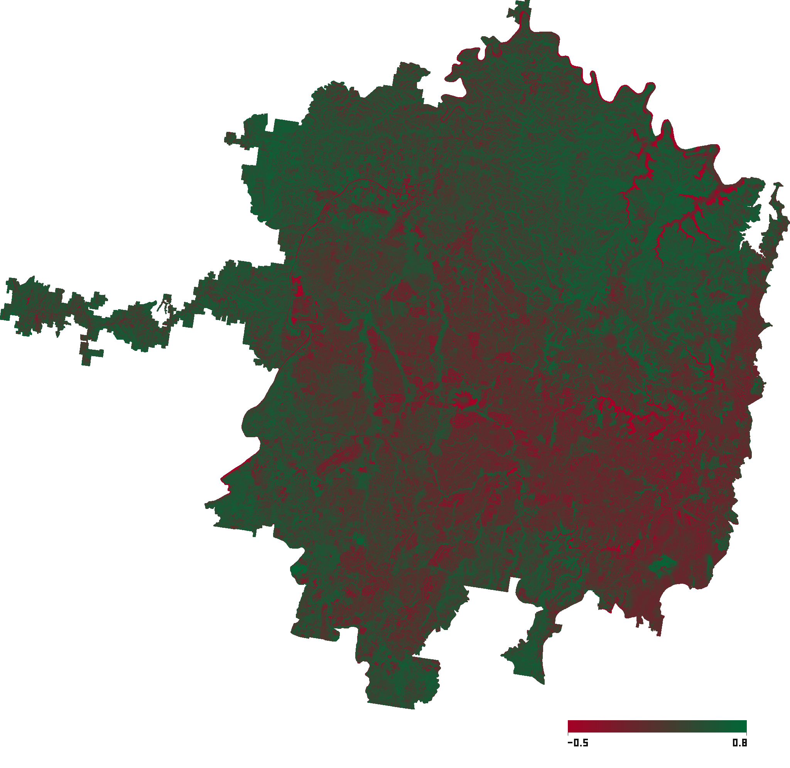
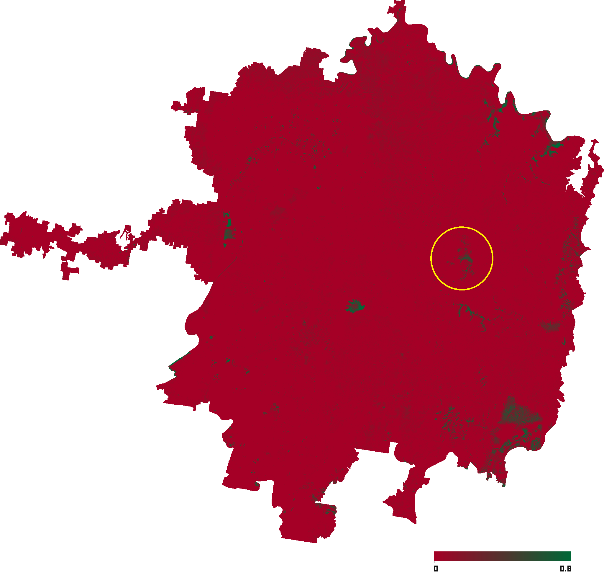
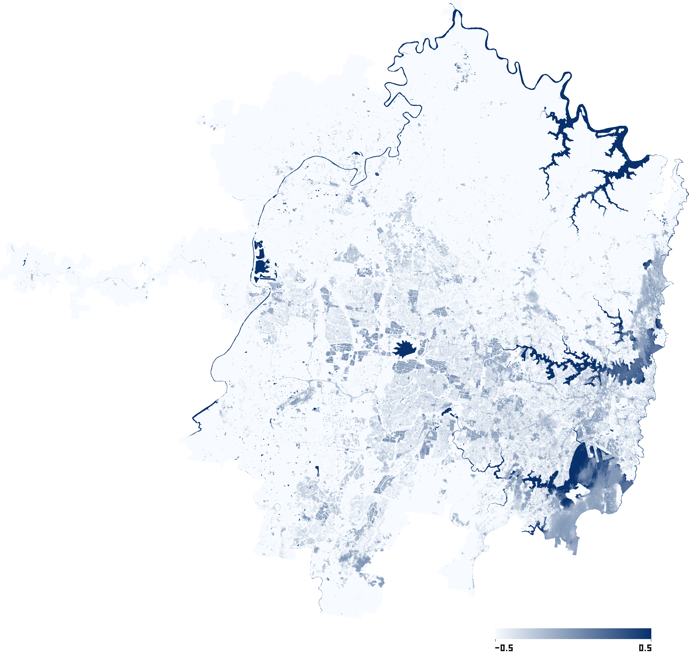

# Demo Cases

中文版: [Demo Cases](../demo-cases.md)

This document shows the current V1 Sentinel-2 index demo cases. Materials come from `docs/materials/`, including generated `preview.png` images and equivalent `metadata.json` files.

All cases use the same user-facing output structure:

```text
data/<uuid>/output/
  metadata.json
  preview.png
  result.tif
```

This page shows only preview images and metadata summaries, not `result.tif`. The preview images demonstrate that the V1 workflow completes end-to-end output; this page does not provide strict quantitative remote-sensing interpretation.

## Chengdu - NDVI



| Field | Value |
| --- | --- |
| Product | NDVI |
| Use | Vegetation greenness, vegetation cover, crop growth |
| AOI | Chengdu, Sichuan, China |
| Data source | Sentinel-2 via earth_search |
| Time range | 2026-04-01 to 2026-05-29 |
| Max cloud cover | 20% |
| Coverage status | covered |
| Coverage ratio | 1.0000 |
| Selected scenes | 5 |
| CRS | EPSG:32648 |
| Resolution | 10 m |
| Raster size | 18231 x 14955 |
| Metadata | [ndvi.json](../materials/ndvi.json) |

## Paris - SAVI



| Field | Value |
| --- | --- |
| Product | SAVI |
| Use | Vegetation analysis in sparse vegetation or strong bare-soil background areas |
| AOI | Paris, France |
| Data source | Sentinel-2 via earth_search |
| Time range | 2026-05-01 to 2026-05-30 |
| Max cloud cover | 20% |
| Coverage status | covered |
| Coverage ratio | 1.0000 |
| Selected scenes | 1 |
| CRS | EPSG:32631 |
| Resolution | 10 m |
| Raster size | 1802 x 961 |
| Metadata | [savi.json](../materials/savi.json) |

## New York - NDWI



| Field | Value |
| --- | --- |
| Product | NDWI |
| Use | Water bodies, water distribution, surface-water extraction |
| AOI | New York, USA |
| Data source | Sentinel-2 via earth_search |
| Time range | 2025-06-01 to 2025-08-31 |
| Max cloud cover | 20% |
| Coverage status | covered |
| Coverage ratio | 1.0000 |
| Selected scenes | 2 |
| CRS | EPSG:32618 |
| Resolution | 10 m |
| Raster size | 4695 x 4924 |
| Metadata | [ndwi.json](../materials/ndwi.json) |

## Guangzhou - NDMI



| Field | Value |
| --- | --- |
| Product | NDMI |
| Use | Vegetation water content, surface moisture, drought stress |
| AOI | Guangzhou, Guangdong, China |
| Data source | Sentinel-2 via earth_search |
| Time range | 2023-11-01 to 2024-08-31 |
| Max cloud cover | 20% |
| Coverage status | covered |
| Coverage ratio | 0.9994 |
| Selected scenes | 2 |
| CRS | EPSG:32649 |
| Resolution | 10 m |
| Raster size | 10980 x 15309 |
| Metadata | [ndmi.json](../materials/ndmi.json) |

## Beijing - NDBI



| Field | Value |
| --- | --- |
| Product | NDBI |
| Use | Built-up areas, impervious surfaces, urban expansion |
| AOI | Beijing, China |
| Data source | Sentinel-2 via earth_search |
| Time range | 2026-01-01 to 2026-05-29 |
| Max cloud cover | 20% |
| Coverage status | covered |
| Coverage ratio | 1.0000 |
| Selected scenes | 8 |
| CRS | EPSG:32650 |
| Resolution | 20 m |
| Raster size | 9953 x 10475 |
| Metadata | [ndbi.json](../materials/ndbi.json) |

## Sydney - NBR

NBR is special because fire detection requires before-and-after comparison. A single TIFF cannot be used alone for burn scar, fire impact, or vegetation damage analysis. This example uses fires in southeastern Australia from late 2023 to early 2024, with the Sydney administrative area as the AOI, and generates NBR previews for two time windows.

<table>
  <tr>
    <th>NBR - 2023-09</th>
    <th>NBR - 2024-02</th>
  </tr>
  <tr>
    <td></td>
    <td></td>
  </tr>
</table>

| Field | 2023-09 | 2024-02 |
| --- | --- | --- |
| Product | NBR | NBR |
| Use | Burn scars, fire impact, vegetation damage | Burn scars, fire impact, vegetation damage |
| AOI | Sydney, New South Wales, Australia | Sydney, New South Wales, Australia |
| Data source | Sentinel-2 via earth_search | Sentinel-2 via earth_search |
| Time range | 2023-09-01 to 2023-09-30 | 2024-02-01 to 2024-02-29 |
| Max cloud cover | 20% | 20% |
| Coverage status | covered | covered |
| Coverage ratio | 1.0000 | 1.0000 |
| Selected scenes | 3 | 3 |
| CRS | EPSG:32756 | EPSG:32756 |
| Resolution | 10 m | 10 m |
| Raster size | 10023 x 9006 | 10023 x 9006 |
| Metadata | [NBR202309.json](../materials/NBR202309.json) | [NBR202402.json](../materials/NBR202402.json) |

Then calculate a dNBR TIFF as pre-fire TIFF minus post-fire TIFF. Higher values indicate more severe damage. Since NBR = (NIR - SWIR) / (NIR + SWIR), and water bodies have very small reflectance in both NIR and SWIR bands, the denominator (NIR + SWIR) is small. As a result, NBR over water can be highly sensitive to small noise. To inspect real fire impact, satellite imagery or an NDWI map should also be used to exclude water-body interference.

<table>
  <tr>
    <th>dNBR - 2023.09-2024.02</th>
    <th>NDWI</th>
  </tr>
  <tr>
    <td></td>
    <td></td>
  </tr>
</table>
